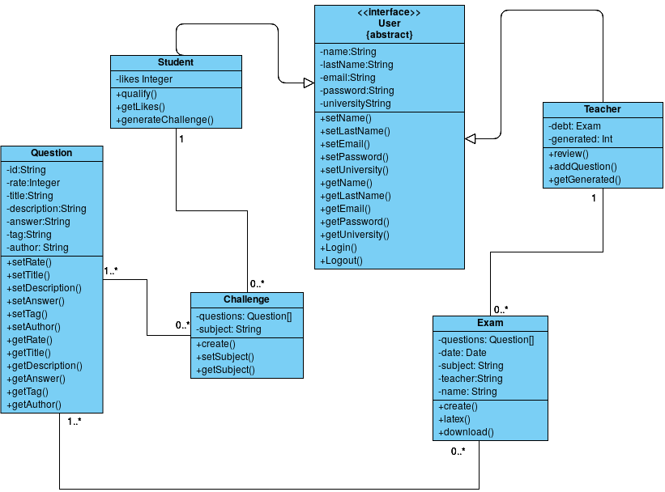

# **Developer Guide**
## Introduction
Easy exam is a plataform that helps both students and teachers streamline their problem-obtainig needs. It does this by using collaborative problem pools that randomly give out exersises bases on tags.It uses circular feedback between studying students and creating teachers, forcing a continuous feedback loop that helps to give the best possible quality for everyone involved.

## Features

## Design 

### Architecture

#### Class Diagram

#### Architecture Diagram

##### Logic

#### Interaction between Components
